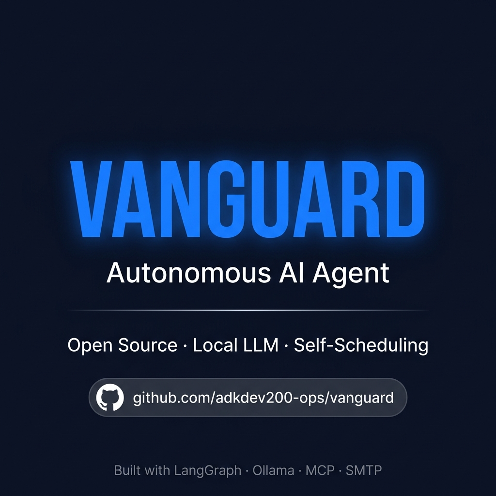

<div align="center">

# ⚡ Vanguard

### Autonomous AI Newsletter Agent

**Vanguard** is a fully autonomous, self-scheduling AI agent that researches the internet, writes a polished HTML newsletter, and mass-delivers it to your mailing list — on autopilot, on your schedule.

[](https://python.org)
[](https://langchain-ai.github.io/langgraph/)
[](LICENSE)
[](https://modelcontextprotocol.io)
[](https://github.com/adkdev200-ops/vanguard)



</div>

---

## 🌟 What Is Vanguard?

Vanguard is a **production-grade autonomous agent system** that eliminates the manual work of researching, writing, and sending newsletters. You configure it once, and it runs forever.

Every cycle, Vanguard:

1. 🔍 **Browses the live internet** — using Playwright to find real, current stories from the last 24–72 hours (or 7 days for weekly editions).
2. ✍️ **Writes an original newsletter** — paraphrasing, curating, and formatting a clean, mobile-friendly HTML email with proper attribution.
3. 📬 **Sends it to your entire mailing list** — reading recipient emails from a CSV and dispatching via Gmail SMTP with per-recipient delivery.
4. 🧠 **Learns from failures** — logging hard-won lessons (e.g., Cloudflare bypasses, lazy-loaded pages) to `memory/failures.txt` so future runs are smarter.
5. 🔁 **Schedules critical follow-ups** — if a topic is time-sensitive (e.g., election results not yet published), it auto-schedules a retry for exactly when the information becomes available.

No cron jobs. No manual triggers after setup. Just one command.

---

## 🏗️ Architecture

```
Vanguard/
├── server.py               # ⏰ Scheduler & entry point
├── agent/
│   ├── agent.py            # 🤖 Tool-calling research agent (LangGraph + MCP)
│   ├── main.py             # 🔀 Orchestration workflow (SuperGraph)
│   └── send_email.py       # 📧 Gmail SMTP dispatcher
├── configs/
│   ├── mcp_servers.json    # 🔧 MCP tool server configuration
│   └── emails.csv          # 📋 Mailing list (one email per row)
├── prompts/
│   ├── systemprompt.md     # 🧠 Research agent identity & newsletter rules
│   ├── followups.md        # 🔁 Follow-up scheduling decision prompt
│   └── post_learning.md    # 📝 Memory extraction prompt
├── memory/
│   ├── failures.txt        # 💾 Persistent agent lessons across runs
│   └── specific_searches.json  # ⏳ Pending follow-up schedule
└── outputs/
    ├── output.html         # 📰 Generated newsletter (latest run)
    └── subject.txt         # ✉️ Email subject line (latest run)
```

### How the Pieces Talk

```
server.py (Scheduler)
    │
    ├─── Every N days/hours ──▶ main.py (SuperGraph)
    │                               │
    │                               ├─▶ researcher node
    │                               │       └─▶ agent.py (MCP Agent)
    │                               │               ├─▶ Playwright (browse web)
    │                               │               ├─▶ Filesystem (write output.html + subject.txt)
    │                               │               └─▶ Sequential Thinking (plan research)
    │                               │
    │                               ├─▶ followup_checker node  (needs retry?)
    │                               ├─▶ save_followups_to_json (persist schedule)
    │                               ├─▶ post_learn node        (extract lessons)
    │                               └─▶ send_email node        (dispatch to CSV list)
    │
    └─── When follow-up is due ──▶ Same pipeline, marked is_followup=True
```

---

## 🚀 Quick Start

### Prerequisites

| Requirement | Notes |
|---|---|
| **Python 3.11+** | |
| **Ollama** | Running locally with a supported model |
| **Node.js + npx** | For MCP server tools (Playwright, Filesystem, etc.) |
| **Gmail account** | With an App Password enabled |

### 1. Clone the Repository

```bash
git clone https://github.com/yourusername/Vanguard.git
cd Vanguard
```

### 2. Set Up a Virtual Environment

```bash
python -m venv myenv
source myenv/bin/activate   # On Windows: myenv\Scripts\activate
```

### 3. Install Python Dependencies

```bash
pip install -r requirements.txt
```

### 4. Install Playwright Browsers

```bash
playwright install chromium
```

### 5. Configure Your Environment

Copy the example env file and fill in your credentials:

```bash
cp .env.example .env
```

Then edit `.env`:

```env
SMTP_EMAIL=your_gmail@gmail.com
SMTP_APP_PASSWORD=xxxx xxxx xxxx xxxx   # 16-char Google App Password
INTERVAL_DAYS=7                          # Optional: default interval fallback
```

> **How to get a Gmail App Password:**
> 1. Go to [myaccount.google.com](https://myaccount.google.com) → **Security**
> 2. Enable **2-Step Verification** (if not already on)
> 3. Search for **"App Passwords"** → create one for "Mail"
> 4. Copy the 16-character code into `SMTP_APP_PASSWORD`

### 6. Add Your Mailing List

Edit `configs/emails.csv` — it must have an `email` header column:

```csv
email
subscriber@example.com
another@example.com
you@yourdomain.com
```

### 7. Configure Your AI Model

Vanguard uses **Ollama** locally. The model is set in `agent/agent.py` and `agent/main.py`. By default it uses `minimax-m3:cloud`. Change it to any model you have pulled:

```bash
ollama pull mistral       # example — use any capable model
```

Then update the model name in both files:

```python
# agent/agent.py and agent/main.py
model = ChatOllama(model="mistral")   # ← change here
```

> 💡 Use a model that supports tool calling (function calling) for best results. Models like `qwen2.5`, `llama3.1`, `mistral-nemo`, or `minimax-m3` work well.

### 8. Run Vanguard

```bash
python server.py
```

You'll see an interactive setup:

```
==================================================
       Vanguard Autonomous Agent Initializer
==================================================

Enter the interval between regular runs (e.g. '7', '7d' for days, '12h' for hours) [default 7d]: 7d
What should the agent research and write about? (e.g. 'Weekly dose of AI'): Weekly dose of AI
Any specific format or instructions for the email? (leave blank for default): Focus on developer tools
```

That's it. Vanguard is now running autonomously. Press `Ctrl+C` to stop.

---

## ⚙️ Configuration Reference

### Scheduling Intervals

| Input | Meaning |
|---|---|
| `7` or `7d` | Every 7 days |
| `1d` | Every day |
| `12h` | Every 12 hours |
| `1h` | Every hour |
| *(blank)* | Default: every 7 days |

### MCP Tool Servers (`configs/mcp_servers.json`)

Vanguard's research agent has access to four MCP-powered tools:

| Tool | Purpose |
|---|---|
| **Playwright** | Full browser automation — browses real websites, handles JavaScript, bypasses paywalls |
| **Filesystem** | Writes `output.html` and `subject.txt` to the `outputs/` directory |
| **Sequential Thinking** | Structured reasoning — helps the agent plan multi-step research before acting |
| **Desktop Commander** | Shell-level operations for advanced automation |

### Topic & Format Instructions

When prompted, you can give Vanguard:

- **A topic**: `"Weekly dose of AI"`, `"What happened in crypto this week"`, `"Top stories in cybersecurity"`
- **Format instructions**: `"Keep summaries under 3 sentences"`, `"Include a meme-worthy quote at the end"`, `"Focus on open-source tools only"`

These are combined and passed to the agent as its objective every run.

---

## 🔁 Autonomous Follow-Up System

Vanguard has a built-in **critical follow-up engine**. Here's how it works:

1. After every research run, the agent checks: *"Was there time-sensitive information I couldn't find yet?"*
2. If yes (e.g., election results expected at 15:00 NPT), it writes a follow-up entry to `memory/specific_searches.json` with the exact retry timestamp.
3. On the **next server loop tick** (every 60 seconds), Vanguard checks if any follow-ups are due.
4. When due, it re-runs the full pipeline as an **urgent follow-up** — marked `is_followup=True` — and sends a dedicated newsletter to your list.

This means if you ask Vanguard to track a live event, it will **keep checking and reporting until it has the answer**.

---

## 🧠 Persistent Memory

Vanguard learns from its own failures. After every run, the `post_learn` node extracts a concise lesson (max 25 words) if something notable was discovered — e.g.:

```
<memory>
The site used Cloudflare; browser automation succeeded after waiting for the challenge to complete.
</memory>
```

These are appended to `memory/failures.txt` and injected into future runs so the agent doesn't repeat the same mistakes.

---

## 📰 Output Format

Every run generates two files in `outputs/`:

### `output.html`
A polished, email-client-safe HTML newsletter:
- **Inline CSS only** (no external stylesheets — compatible with Gmail, Outlook, Apple Mail)
- **~600px max-width**, centered, responsive
- Structure: Masthead → Intro → 5–10 story items with headlines, 2–4 sentence summaries, and source attribution → Footer
- Clean, professional typography with system font stack

### `subject.txt`
A single-line, concrete email subject. Never generic — always specific to the lead story:
```
OpenAI's $230 keypad, Suno's scraped 2M songs, EU cracks open Google
```

---

## 🐛 Troubleshooting

| Problem | Fix |
|---|---|
| `SMTP_EMAIL and SMTP_APP_PASSWORD must be set` | Check your `.env` file exists and has correct values |
| `Error reading emails.csv` | Ensure `configs/emails.csv` has an `email` column header |
| Agent produces no output | Check Ollama is running: `ollama serve` |
| Playwright browser not found | Run `playwright install chromium` |
| `Failed to parse structured output from followup model` | This is handled gracefully — the follow-up defaults to `needs_followup=False` |
| Model doesn't support tools | Switch to a tool-calling model like `qwen2.5` or `llama3.1` |

---

## 📦 Dependencies Overview

| Package | Role |
|---|---|
| `langgraph` | Agent orchestration & state graph |
| `langchain-ollama` | Ollama LLM integration |
| `langchain-mcp-adapters` | MCP tool server integration |
| `mcp` | Model Context Protocol client |
| `pydantic` | Structured output parsing (FollowUp schema) |
| `pandas` | Reading the mailing list CSV |
| `python-dotenv` | `.env` file loading |
| `smtplib` (stdlib) | Gmail SMTP email delivery |

---

## 🛡️ Privacy & Security

- **`.env` is gitignored** — your SMTP credentials are never committed.
- **`outputs/` is gitignored** — generated newsletter content stays local.
- **`myenv/` is gitignored** — virtual environment not tracked.
- Emails are sent **individually per recipient** (no CC/BCC leaking addresses).

---

## 🗺️ Project Structure Summary

```
Vanguard/
├── .env                        # Your secrets (never committed)
├── .env.example                # Template — copy and fill in
├── .gitignore                  # Excludes secrets, venv, outputs
├── requirements.txt            # All Python dependencies (pinned)
├── server.py                   # Main entry point & scheduler
├── agent/
│   ├── __init__.py
│   ├── agent.py                # MCP-powered research agent
│   ├── main.py                 # LangGraph SuperGraph orchestrator
│   └── send_email.py           # Gmail SMTP sender
├── configs/
│   ├── emails.csv              # ← ADD YOUR SUBSCRIBERS HERE
│   └── mcp_servers.json        # MCP tool server definitions
├── prompts/
│   ├── systemprompt.md         # Agent identity & newsletter rules
│   ├── followups.md            # Follow-up decision logic
│   └── post_learning.md        # Memory extraction rules
├── memory/
│   ├── failures.txt            # Agent lessons (auto-generated)
│   └── specific_searches.json  # Follow-up schedule (auto-generated)
└── outputs/
    ├── output.html             # Latest newsletter (auto-generated)
    └── subject.txt             # Latest subject line (auto-generated)
```

---

## 📜 License

MIT License — see [LICENSE](LICENSE) for details.

---

<div align="center">
  <sub>Built with LangGraph · Powered by Ollama · Delivered by SMTP</sub>
</div>
